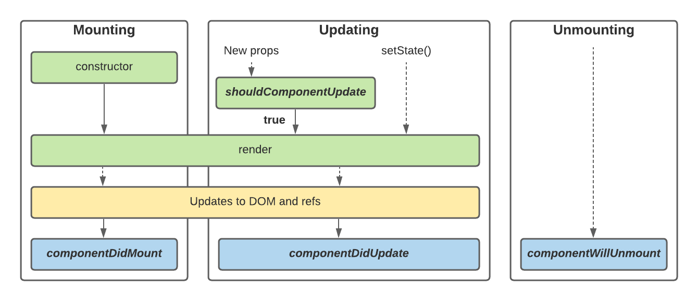

# ReactJS là gì 
- Là thư viện JS phát triển bởi Facebook 
=> Xây dựng giao diện người dùng cho các ứng dụng web hiện đại
- Thường được sử dụng để xây dựng các trang web đơn trang (Single Page Application - SPAs)
(Là nơi nội dung cập nhật mà không cần tải toàn bộ tại trang)

+ So sáng SPAs và MPAs

## Single Page Application (SPAs)

1. Kiến trúc
- Đơn trang: SPAs chỉ có một trang HTML và nội dung thay đổi động thông qua việc tải dữ liệu và cập nhật qua DOM mà không cần tải lại trang
2. Tải trang
- Nhanh: Vì SPAs không yêu cầu tải lại toàn bộ trang 
=> Trải nhiệm người dùng nhanh hơn (nhất là khi ta điều hướng trang)
3. Hiệu suât:
- Tăng cường hiệu suất: Sử dụng Virtual DOM và cập nhật chỉ những phần cần thiết giúp tối ưu hiệu suất
4. Phản hồi người dùng 
- Ngay lập tức:  Phản hồi thường xuyên ngay lập tức khi ta thay dodoori trạng tháo, không cần phải tải lại trang
5. Phát triển
- Phức tạp hơn: Phát triển SPAs cso thể phức tạp hơn do quản lý trạng thái và điều hướng trên máy khách

## Multi Page Application (MPAs)

1. Kiến trúc: 
- Nhiều trang: MPAs có nhiều trang HTML riêng mỗi trang thường chưa một nội dung và logic riêng
2. Tải trang:
- Chậm hơn: Mỗi lần chuyển trang sẽ yêu cầu tải lại toàn bộ trang
3. Hiệu suất: 
- Yêu cầu nhiều tài nguyên: Vì mỗi trang đều cần tải lại => tốn tài nguyên mạng hơn so với SPAs
4. Phản hồi người dung:
 - Độ trễ: Phản hồi người dùng có độ trễ, đặc biệt là khi điều hướng trang
5. Phát triển:
- Quản lý dễ hơn: MPAs phát triển và quản lý đơn giản hơn vì mỗi trang được quản lý độc lập

### Lựa chọn

- SPAs: Thích hợp cho ứng dụng đòi hỏi hỏi trải nhiệm người dùng linh hoạt và độ tương tác cao như các ứng dụng mạng xã hội hay quảng cáo, bán hàng, ...
- MPAs: Phù hợp với các trang web thông thường hoặc khi yêu cầu trải nhiệm người dùng động và phức tạp như các web tin tức hay các blog, ...

# Đặc điểm điểm của ReactJS 
- Component:  Chia giao diện người dùng thành các component, giúp tăng việc tái sử dụng và quản lý trạng thái của ứng dụng dễ dàng
- Virtual DOM: Được React sử dụng một biến thể DOM được gọi là DOM ảo để tối ưu hóa hiệu suất. Thay vì cập nhật trực tiếp. DOM ảo khi phát hiện thay đổi, React sẽ tạo ra bản sao của DOM và thực hiện các thay đổi trên bản sao đó, cập nhật DOM thực tế chỉ khi cần thiết
- JSX: React sử dụng JSX, một phần mở rộng của JS để định nghĩa giao diện người dùng, JSX cho phép viết mã HTML trong các tệp JS giúp dễ đọc code hơn
- Data Flow: Dữ liệu trong React chạy một chiều từ cha đến con => giúp quản lý trạng thái dễ dàng và dự đoán dược
- React Router: Để quản lý định tuyến trong ứng dụng giúp điều hướng không cần tải lại trang.

# JSX

- JSX là một phần mở rộng cú pháp cho JavaScript cho phép bạn viết đánh dấu giống HTML bên trong tệp JavaScript. Mặc dù có nhiều cách khác để viết các thành phần, nhưng hầu hết các nhà phát triển React đều thích sự đơn giản của JSX và hầu hết các cơ sở mã đều sử dụng nó.

## JSX: Đưa đánh dấu vào JavaScript

- Web đã được xây dựng trên HTML, CSS và JavaScript. Trong nhiều năm, các nhà phát triển web giữ nội dung bằng HTML, thiết kế bằng CSS và logic bằng JavaScript—thường ở các tệp riêng biệt! Nội dung được đánh dấu bên trong HTML trong khi logic của trang tồn tại riêng biệt trong JavaScript:


- Nhưng khi Web trở nên tương tác hơn, logic ngày càng quyết định nội dung. JavaScript chịu trách nhiệm về HTML! Đây là lý do tại sao trong React, logic hiển thị và đánh dấu tồn tại cùng một nơi—các thành phần.


- Việc kết hợp logic kết xuất và đánh dấu của một nút sẽ đảm bảo rằng chúng luôn đồng bộ với nhau trong mỗi lần chỉnh sửa. Ngược lại, các chi tiết không liên quan, chẳng hạn như đánh dấu của nút và đánh dấu của thanh bên, được tách biệt với nhau, giúp việc tự thay đổi một trong hai chi tiết đó an toàn hơn.

### Chú ý 

- *JSX và React là hai thứ riêng biệt. Chúng thường được sử dụng cùng nhau nhưng bạn có thể  sử dụng chúng độc lập với nhau. JSX là một phần mở rộng cú pháp, trong khi React là thư viện JavaScript.*

## Các quy tắc của JSX

1. **Trả về một phần tử gốc**
- Để trả về nhiều phần tử từ một thành phần, hãy bọc chúng bằng một thẻ cha duy nhất.

Ví dụ: bạn có thể sử dụng <div>:

```javascript
<div>
  <h1>Hedy Lamarr's Todos</h1>
  
  <ul>
    ...
  </ul>
</div>
```

- Nếu bạn không muốn thêm phần bổ sung <div> vào đánh dấu của mình, bạn có thể viết <>và </> thay vào đó: 

```javascript
<>
  <h1>Hedy Lamarr's Todos</h1>
  
  <ul>
    ...
  </ul>
</>
```
- Thẻ trống này được gọi là Fragment. Phân đoạn cho phép bạn nhóm mọi thứ mà không để lại bất kỳ dấu vết nào trong cây HTML của trình duyệt.


***Tại sao cần phải bọc nhiều thẻ JSX***

- *JSX trông giống như HTML, nhưng bên trong nó được chuyển đổi thành các đối tượng JavaScript đơn giản. Bạn không thể trả về hai đối tượng từ một hàm mà không gói chúng vào một mảng. Điều này giải thích tại sao bạn cũng không thể trả về hai thẻ JSX mà không gói chúng vào một thẻ khác hoặc một Đoạn.*

2. **Đóng tất cả các thẻ**

- JSX yêu cầu các thẻ phải được đóng rõ ràng: các thẻ tự đóng như ``` ```và các thẻ gói như``` <li> ```phải được viết dưới dạng ```<li>```oranges```</li>```.

Đây là hình ảnh và danh sách các mục trông như thế nào:
```javascript
<>
  
  <ul>
    <li>Invent new traffic lights</li>
    <li>Rehearse a movie scene</li>
    <li>Improve the spectrum technology</li>
  </ul>
</>
```
3. **Quy tắc CamelCase**

- JSX biến thành JavaScript và các thuộc tính được viết bằng JSX trở thành khóa của các đối tượng JavaScript. Trong các thành phần của riêng bạn, bạn thường muốn đọc các thuộc tính đó thành các biến. Nhưng JavaScript có những hạn chế về tên biến. Ví dụ: tên của họ không được chứa dấu gạch ngang hoặc là các từ dành riêng như class.

- Đây là lý do tại sao trong React, nhiều thuộc tính HTML và SVG được viết bằng CamelCase. Ví dụ: thay vì stroke-width bạn sử dụng strokeWidth. Vì class là một từ dành riêng nên trong React bạn viết className thay thế, được đặt tên theo thuộc tính DOM tương ứng :

```javascript


```

### Cạm bẫy

- *Vì lý do lịch sử aria-** và *data-** *các thuộc tính được viết dưới dạng HTML với dấu gạch ngang.*

### Sử dụng Trình chuyển đổi JSX

- [Sử dụng trình chuyển đổi](https://transform.tools/html-to-jsx) để dịch HTML và SVG hiện có của mình sang JSX. Các trình chuyển đổi rất hữu ích trong thực tế, nhưng vẫn đáng để hiểu những gì đang diễn ra để bạn có thể thoải mái tự viết JSX.


#  Virtual DOM

- DOM (Document Object Model) là cách mà các trình duyệt hiển thị và tương tác với các thành phần của một trang web. DOM biểu diễn cấu trúc cây của các phần tử HTML dưới dạng các đối tượng có thể được truy cập và thao tác bằng JavaScript.

- Virtual DOM là một bản sao nhẹ của DOM thật sự, được React (và các framework khác) sử dụng để tối ưu hóa hiệu suất và cải thiện quá trình render của ứng dụng web.

## Cách hoạt động của Virtual DOM:

- Bước 1: Render Virtual DOM: Khi một component trong ứng dụng React thay đổi state hoặc props, React sẽ tạo ra một cây Virtual DOM mới dựa trên dữ liệu này.
- Bước 2: So sánh Virtual DOM: React sẽ so sánh cây Virtual DOM mới với cây Virtual DOM cũ (của bước trước) để xác định những thay đổi (diffing).
- Bước 3: Cập nhật DOM thực: Sau khi xác định được những thay đổi cần thiết, React sẽ cập nhật chỉ những phần tử thực sự thay đổi trong DOM thật mà không cần render lại toàn bộ trang.

## Lợi ích của Virtual DOM:

- Tối ưu hóa hiệu suất: Thay vì cập nhật trực tiếp DOM thực mỗi khi có thay đổi, React sử dụng Virtual DOM để giảm thiểu số lần truy cập và thay đổi trên DOM.
- Cập nhật hiệu quả: Nhờ vào diffing, React chỉ cập nhật những phần tử cần thiết trong DOM, giúp giảm thiểu thời gian và tài nguyên cần thiết cho quá trình render.
- Bảo trì dễ dàng: Virtual DOM giúp React dễ dàng theo dõi và quản lý các thay đổi, từ đó giảm thiểu các lỗi và tối ưu hóa quá trình phát triển ứng dụng.

# Component

- Trong React, một component (thành phần) là một khối xây dựng cơ bản của ứng dụng React. Mỗi component tương ứng với một phần tử giao diện (UI) và có thể bao gồm các thành phần con khác. Components cho phép bạn chia nhỏ giao diện người dùng thành các phần nhỏ, độc lập, có thể tái sử dụng và quản lý một cách dễ dàng.

## Function Components

- Function components là các hàm JavaScript đơn giản trả về các phần tử React. Chúng dễ hiểu và dễ viết.

```javascript

function Greeting(props) {
  return <h1>Hello, {props.name}!</h1>;
}

```

## Class Components

- Class components là các lớp JavaScript mở rộng từ React.Component và phải có phương thức render trả về các phần tử React.

```javascript

class Greeting extends React.Component {
  render() {
    return <h1>Hello, {this.props.name}!</h1>;
  }
}

```

## Chia Component

- Tách các phần tử có mục đích riêng biệt
- Tách compontent cha và con
- Bắt đầu từ component cha và sau đó chia nhỏ thành các component con. Điều này giúp bạn nhìn thấy tổng thể trước khi đi vào chi tiết.
- Hoặc bắt đầu từ các component nhỏ và cơ bản nhất. Sau đó kết hợp chúng lại để tạo ra các component phức tạp hơn.

# State, Props

## State 

- Trong React, state là một đối tượng chứa các thuộc tính (properties) mà component quản lý. Nó là một trong những yếu tố quan trọng nhất để quản lý trạng thái và hiển thị của một component trong quá trình thực thi. State của một component có thể thay đổi theo thời gian dựa vào các sự kiện và điều kiện khác nhau, và việc thay đổi này thường dẫn đến việc cập nhật giao diện người dùng.

### Đặc điểm của State 

- Có thể thay đổi: State là dữ liệu có thể thay đổi trong quá trình thực thi của component.
- Cục bộ cho component: State chỉ được sử dụng và quản lý bởi component mà nó thuộc về.
- Cập nhật dữ liệu: Việc thay đổi state thông qua phương thức setState() sẽ gây ra việc render lại component và các component con.

## Props

- Props (viết tắt của Properties) là một đối tượng chứa các thuộc tính (properties) được truyền vào component từ component cha (hoặc từ bên ngoài) khi component được sử dụng. Các props là bất biến (immutable), nghĩa là không thể thay đổi giá trị của chúng từ bên trong component nhận props.

### Đặc điểm của Props 

- Bất biến (Immutable): Props không thể thay đổi giá trị từ bên trong component nhận props.
- Được truyền từ cha xuống: Props được truyền từ component cha xuống component con để truyền dữ liệu giữa các component.
- Thay đổi sẽ cập nhật từ cha: Khi props thay đổi từ component cha, React sẽ tự động cập nhật lại các component con có sử dụng props đó.

## Phân biệt giữa State và Props

### Ngữ cảnh sử dụng

- State được quản lý và sử dụng bởi component mà nó thuộc về, và được dùng để lưu trữ và quản lý trạng thái nội tại của component.
- Props được truyền từ component cha xuống component con, và được sử dụng để truyền dữ liệu giữa các component.

### Thay đổi giá trị

- State có thể thay đổi giá trị bằng cách gọi phương thức setState(), dẫn đến việc cập nhật lại giao diện người dùng.
- Props là bất biến (immutable), không thể thay đổi giá trị từ bên trong component nhận props, chỉ có thể thay đổi từ bên ngoài (từ component cha).

### Quản lý và phản ứng với thay đổi

- Khi state thay đổi, React sẽ tự động cập nhật lại giao diện của component và các component con liên quan.
- Khi props thay đổi từ component cha, React sẽ tự động cập nhật lại các component con có sử dụng props đó.

# Lifecycle 



```javascript

import React, { useState, useEffect } from 'react';

const ExampleComponent = () => {
  const [count, setCount] = useState(0);
  useEffect(() => {
    console.log('Component đã được render');
    return () => {
      console.log('Component sẽ bị hủy bỏ');
    };
  }, []); 

  useEffect(() => {
    console.log('Count đã thay đổi:', count);
  }, [count]); 

  const incrementCount = () => {
    setCount(prevCount => prevCount + 1);
  };

  return (
    <div>
      <p>Count: {count}</p>
      <button onClick={incrementCount}>Increment</button>
    </div>
  );
};

export default ExampleComponent;

```

# Functional component

## Hook
- Hooks trong ReactJS là một tính năng được giới thiệu từ phiên bản React 16.8, cho phép bạn sử dụng state và các tính năng khác của React mà không cần phải viết các class component.  
## useState
- useState cho phép bạn thêm state vào các functional component.
- Sử dụng khi muốn quản lý các state trong component 

```javascript

import React, { useState } from 'react';

function Counter() {
  const [count, setCount] = useState(0);

  return (
    <div>
      <p>Count: {count}</p>
      <button onClick={() => setCount(count + 1)}>Increment</button>
    </div>
  );
}

export default Counter;

```
## useEffect
- useEffect cho phép bạn thực hiện các side effects trong các functional component, chẳng hạn như fetch dữ liệu, đăng ký hoặc hủy đăng ký subscriptions, hoặc cập nhật DOM trực tiếp.
- Không có dependencies: useEffect chạy sau mỗi lần render.

```javascript
import React, { useEffect, useState } from 'react';

function Example() {
  const [count, setCount] = useState(0);

  useEffect(() => {
    console.log('Component render');
  });

  return (
    <div>
      <p>Count: {count}</p>
      <button onClick={() => setCount(count + 1)}>Increment</button>
    </div>
  );
}

export default Example;

```

- Mảng dependencies rỗng: useEffect chỉ chạy một lần khi component mount và cleanup khi component unmount.

```javascript
import React, { useEffect } from 'react';

function Example() {
  useEffect(() => {
    console.log('Component did mount');
    return () => {
      console.log('Component will unmount');
    };
  }, []); 

  return <div>Component</div>;
}

export default Example;

```
- Dependencies cụ thể: useEffect chạy khi một hoặc nhiều giá trị trong mảng dependencies thay đổi.

```javascript
import React, { useEffect, useState } from 'react';

function Example() {
  const [count, setCount] = useState(0);
  const [text, setText] = useState('');

  useEffect(() => {
    console.log('Count changed:', count);
  }, [count]); 

  return (
    <div>
      <p>Count: {count}</p>
      <button onClick={() => setCount(count + 1)}>Increment</button>
      <input value={text} onChange={e => setText(e.target.value)} />
    </div>
  );
}

export default Example;
```
- Cleanup: useEffect trả về một function để dọn dẹp các tác vụ đang diễn ra hoặc các subscriptions khi component unmount hoặc trước khi chạy effect tiếp theo.
```javascript
import React, { useEffect, useState } from 'react';

function Example() {
  const [count, setCount] = useState(0);

  useEffect(() => {
    const interval = setInterval(() => {
      setCount(count => count + 1);
    }, 1000);
    return () => {
      clearInterval(interval);
    };
  }, []); 

  return <div>Count: {count}</div>;
}

export default Example;

```
- Fetch dữ liệu: useEffect thường được sử dụng để fetch dữ liệu từ API khi component mount.

```javascript
import React, { useEffect, useState } from 'react';

function Example() {
  const [data, setData] = useState(null);

  useEffect(() => {
    fetch('https://api.example.com/data')
      .then(response => response.json())
      .then(data => setData(data))
      .catch(error => console.error('Error fetching data:', error));
  }, []); 

  if (!data) {
    return <div>Loading...</div>;
  }

  return (
    <div>
      <p>{data}</p>
    </div>
  );
}

export default Example;
```
## useMemo

- Cho phép bạn memoize kết quả của một hàm tính toán.
- Tăng hiệu suất bằng cách lưu kết quả của một hàm tính toán và sử dụng lại nó nếu các dependencies không thay đổi.
- Thường được sử dụng để tránh việc tính toán không cần thiết trong quá trình render.

```javascript
import React, { useState, useMemo } from 'react';

function ExpensiveCalculation({ value }) {
    const result = useMemo(() => {
       
        return value * 2;
    }, [value]);

    return <p>Result: {result}</p>;
}

export default ExpensiveCalculation;
```

## useCallback

- Cho phép bạn memoize một callback function.
- Tránh việc tạo lại các hàm callback mới trong mỗi lần render, giảm bớt việc render lại của các component con.
- Thường được sử dụng khi truyền các hàm callback vào các component con.
```javascript
import React, { useState, useCallback } from 'react';

function ParentComponent() {
    const [count, setCount] = useState(0);

    const increment = useCallback(() => {
        setCount(count + 1);
    }, [count]);

    return (
        <div>
            <p>Count: {count}</p>
            <ChildComponent onIncrement={increment} />
        </div>
    );
}

function ChildComponent({ onIncrement }) {
    return <button onClick={onIncrement}>Increment</button>;
}

export default ParentComponent;
```

#  react-router-dom